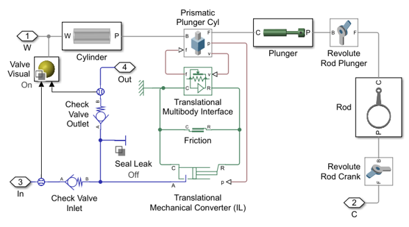

# **Triplex Pump with Faults**
Copyright 2017-2023 The MathWorks(TM), Inc.

This example models a triplex pump. Three plungers are attached to a single crankshaft 
with crankpins that are 120 degrees out of phase. The result is that at least one chamber 
is always discharging which produces smoother flow than single or duplex pumps.

Mechanical, hydraulic, and electrical parameters are all defined in MATLAB. This lets you 
easily resize the pump. Default parameters are for a CAT Pumps pump model 1051, and the 
STEP file that is used for the housing was downloaded from the CAT Pumps website.

Effects of failing components are included in this example. Degraded behavior due 
to seal leakage, blocked inlets, bearing wear, and broken motor windings can be simulated. 
MATLAB code shows how to accelerate testing by reusing results from previous simulations.

Open the project Triplex_Pump.prj to begin.

View on File Exchange:   
You can also open in MATLAB Online: 

## **Main Model**

## **Mechanical System**

## **Piston Chamber**

## **Synthetic Data to Train Algorithm**
